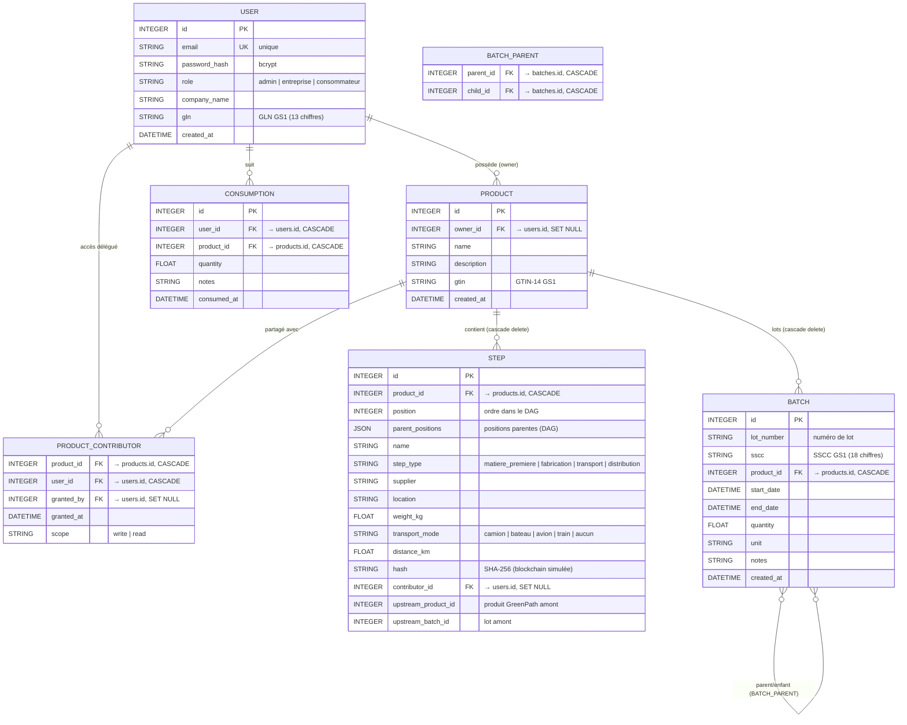

# GreenPath — Traçabilité RSE & Supply Chain

> **Problématique :** Comment permettre aux entreprises européennes de tracer l'impact environnemental de leurs produits le long de leur supply chain afin de répondre aux obligations réglementaires et valoriser leur engagement RSE ?

GreenPath est une application web full-stack qui permet aux entreprises de tracer chaque étape du cycle de vie de leurs produits (matières premières, fabrication, transport, distribution), de calculer leur empreinte CO₂ et de la partager avec les consommateurs via QR code.

---

## Stack technique

| Couche | Choix | Pourquoi |
|---|---|---|
| Frontend | **Angular 17** (standalone components, signals, Reactive Forms) | Organisation claire, idéal pour le travail en équipe |
| Backend | **Python 3 + FastAPI** | API REST rapide, doc Swagger auto |
| ORM | **SQLAlchemy** | Mapping objet/relationnel simple |
| Base de données | **SQLite** (fichier local `greenpath.db`) | Zéro install |
| Validation | **Pydantic v2** + **email-validator** | Validation des entrées API |
| Auth | **JWT** (`pyjwt`) + **bcrypt** (`passlib`) | Standard pour SPA + hash de passwords sécurisé |
| Blockchain (simulée) | Fonction `anchor()` → hash SHA-256 | Remplaçable par Hyperledger en V2 |
| QR Code | `qrcode` (Python) | Un QR par produit |
| Identifiants GS1 | GLN (entreprise) + GTIN (produit) + SSCC (lot) | Norme internationale supply chain |
| **Chatbot RAG** | `sentence-transformers` + `ChromaDB` + HF Inference API | Retrieval sémantique local (gratuit) + LLM via Hugging Face |

---

## Schéma de la base de données



**Règles importantes :**
- Cascade delete sur `STEP`, `BATCH`, `PRODUCT_CONTRIBUTOR` : supprimer un produit supprime toutes ses données associées.
- SET NULL sur `PRODUCT.owner_id` : supprimer un utilisateur conserve ses produits (visibles par l'admin).
- Le CO₂ n'est **pas stocké** : recalculé à la volée depuis `services/co2.py` (facteurs ADEME).

---

## Système d'authentification et de rôles

| Rôle | Accès |
|---|---|
| **`admin`** | Tous les produits toutes entreprises · CRUD utilisateurs · gestion des rôles |
| **`entreprise`** | Ses propres produits uniquement · peut déléguer l'accès à d'autres entreprises |
| **`consommateur`** | Scan produits (QR code) · historique personnel · accès au chatbot |
| (non-connecté) | Page vitrine publique + `/public/products/{id}` |

**Compte admin par défaut** (premier démarrage, aucun utilisateur en base) :

| Email | Mot de passe |
|---|---|
| `admin@greenpath.com` | `admin123` |

**Flux JWT :** POST `/auth/login` → JWT signé HS256 (24h) → `Authorization: Bearer <token>` sur toutes les requêtes → intercepteur Angular gère le 401.

---

## Fonctionnalités

### Page vitrine (publique)
- Présentation de l'application, des fonctionnalités par rôle, de l'équipe
- Navigation vers la démo et les comptes disponibles
- Accès sans connexion

### Saisie produit + étapes
- Formulaire Angular avec étapes dynamiques (ajouter/supprimer/réordonner)
- Validation côté front (Reactive Forms) **et** côté back (Pydantic)
- Support du graphe orienté acyclique (DAG) : chaque étape peut avoir plusieurs étapes parentes
- Visualisation interactive de la chaîne sous forme de timeline/DAG

### Blockchain simulée (SHA-256)
- Chaque étape reçoit un hash SHA-256 calculé depuis ses données + le hash de l'étape précédente
- Recalcul automatique à la création/modification d'une étape
- Badge "Vérifié" si la chaîne est intègre (hashes cohérents)

### QR code consommateur
- Génération d'un QR code par produit pointant vers `/p/{id}`
- Page publique consommateur : détail du produit, empreinte CO₂, étapes de la supply chain
- Utilisable depuis un téléphone sur le même réseau local

### Dashboard RSE
- 4 KPIs en cartes (filtrés automatiquement selon rôle)
- Liste avec colonne CO₂ et colonne Entreprise (admin uniquement)
- Modale de détail avec barre de répartition CO₂ multicolore par étape
- Recherche textuelle + filtres avancés (type d'étape, transport, fournisseur, lieu, poids, distance, CO₂)
- Chips de filtres actifs retirables
- Calcul CO₂ basé sur les facteurs ADEME

### Identifiants GS1
- GLN (Global Location Number, 13 chiffres) généré automatiquement pour chaque utilisateur
- GTIN-14 (Global Trade Item Number) généré pour chaque produit
- SSCC (Serial Shipping Container Code, 18 chiffres) disponible sur les lots

### Gestion des lots (Batches)
- Création et gestion de lots de production par produit
- Numéro de lot, dates début/fin, quantité, unité, notes
- Relations parent/enfant entre lots (traçabilité multi-niveaux)
- SSCC GS1 automatique par lot

### Accès multi-entreprise (Contributors)
- Une entreprise peut déléguer l'accès à un de ses produits à une autre entreprise
- Scope configurable (write/read)
- L'entreprise contributrice peut saisir les étapes qui lui incombent
- Référencement de produits ou lots amont (upstream_product_id, upstream_batch_id)

### Suivi consommateur (Consumption)
- Le consommateur ajoute des produits à son historique de consommation via QR code
- Quantité et notes par entrée
- Historique personnel consultable dans l'application

### Chatbot RAG — GreenBot
- Bulle verte en bas à droite, accessible une fois connecté
- Pipeline complet : embeddings sémantiques (sentence-transformers) → ChromaDB → LLM (Mistral-7B via Hugging Face)
- Filtres de retrieval métier par rôle (consommateur : ses produits scannés ; entreprise : ses produits ; admin : tout)
- Classement CO₂ exact injecté dans le prompt pour des réponses factuelles
- Sources affichées sous chaque réponse (transparence)
- Indexation incrémentale : créer/modifier/supprimer un produit met à jour Chroma automatiquement
- Knowledge base ADEME intégrée (`backend/knowledge/co2_facts.md`)

### Administration
- CRUD complet des utilisateurs (admin)
- Changement de rôle, réinitialisation de mot de passe
- Garde-fous : l'admin ne peut pas se supprimer ni se retirer son propre rôle

---

## Chatbot RAG — Architecture

```
┌──────────────────┐  embed   ┌──────────────┐
│ Question user    │ ───────► │ sentence-    │
│ (français)       │          │ transformers │ (multilingue, local)
└──────────────────┘          └──────┬───────┘
                                     │ vecteur 384-dim
                                     ▼
┌──────────────────────────────────────────────────┐
│ ChromaDB (vector store local, persistant)        │
│  - Tous les produits + étapes (indexés au boot)  │
│  - Knowledge base CO2 (knowledge/*.md)           │
└──────────────────────┬───────────────────────────┘
                       │ top-10 documents (filtrés par rôle)
                       ▼
┌──────────────────────────────────────────────────┐
│ Prompt : instructions système + classement CO₂  │
│ exact depuis BDD + contexte RAG + historique     │
└──────────────────────┬───────────────────────────┘
                       │ POST
                       ▼
┌──────────────────────────────────────────────────┐
│ Hugging Face Inference API                       │
│ Modèle : Mistral-7B-Instruct-v0.3               │
└──────────────────────┬───────────────────────────┘
                       │
                       ▼
            Réponse + sources affichées dans le widget
```

### Configurer le token Hugging Face

1. Créer un compte gratuit sur https://huggingface.co
2. Aller sur https://huggingface.co/settings/tokens → **New token** (type Read) → nommer `greenpath`
3. Copier la valeur (commence par `hf_...`)
4. Dans le projet :

```bash
cd backend
cp .env.example .env
# Éditer .env et coller le token sur la ligne HF_TOKEN=
```

5. Redémarrer le backend → GreenBot est prêt.

> Sans token, le widget s'affiche mais répond "Le chatbot n'est pas configuré". Le reste de l'application fonctionne normalement.

---

## Structure du projet

```
tnsi_greenpath/
├── backend/
│   ├── app/
│   │   ├── main.py                # Assemblage FastAPI (SRP : CORS + routers uniquement)
│   │   ├── startup.py             # Migrations + bootstrap admin/hashes/GS1 (SRP)
│   │   ├── database.py            # Connexion SQLite + session SQLAlchemy
│   │   ├── models.py              # 7 modèles : User, Product, Step, Batch, BatchParent,
│   │   │                          #             ProductContributor, Consumption
│   │   ├── schemas.py             # Schémas Pydantic + validations
│   │   ├── dependencies.py        # get_current_user, require_admin
│   │   ├── routers/               # 8 routers (HTTP uniquement, SRP)
│   │   │   ├── auth.py            # /auth/login, /auth/me
│   │   │   ├── users.py           # /users (admin)
│   │   │   ├── products.py        # /products (filtré par rôle)
│   │   │   ├── batches.py         # /batches (lots de production)
│   │   │   ├── contributors.py    # /contributors (accès multi-entreprise)
│   │   │   ├── consumption.py     # /consumption (historique consommateur)
│   │   │   ├── chat.py            # /chat (GreenBot — délègue à services/chat.py)
│   │   │   └── public.py          # /public/products/{id} (QR code)
│   │   ├── services/              # Logique métier (SRP)
│   │   │   ├── auth.py            # bcrypt + JWT
│   │   │   ├── co2.py             # Calcul empreinte carbone (facteurs ADEME)
│   │   │   ├── blockchain.py      # Hash SHA-256 + vérification de chaîne
│   │   │   ├── gs1.py             # Génération GLN, GTIN, SSCC
│   │   │   ├── rag.py             # ChromaDB : indexation + retrieval
│   │   │   ├── llm.py             # Client LLM Hugging Face
│   │   │   └── chat.py            # Pipeline RAG→LLM orchestrée (SRP)
│   │   └── knowledge/
│   │       └── co2_facts.md       # Base de connaissances ADEME pour le RAG
│   ├── seed_demo.py               # Jeu de données démo (idempotent)
│   └── requirements.txt
│
├── frontend/
│   └── src/app/
│       ├── app.component.ts        # Shell + barre de navigation globale
│       ├── app.config.ts           # Providers (HttpClient + intercepteur JWT)
│       ├── app.routes.ts           # Routes protégées par guards
│       ├── models/
│       │   ├── product.model.ts
│       │   └── auth.model.ts
│       ├── services/
│       │   ├── product.service.ts
│       │   ├── user.service.ts
│       │   ├── auth.service.ts
│       │   └── auth.interceptor.ts
│       ├── guards/
│       │   └── auth.guard.ts       # authGuard, adminGuard, guestGuard
│       └── components/
│           ├── landing/            # Page vitrine publique
│           ├── login/              # Page de connexion
│           ├── product-form/       # Création/édition produit + étapes DAG
│           ├── product-list/       # Dashboard RSE
│           ├── product-timeline/   # Visualisation DAG de la supply chain
│           ├── product-public/     # Page consommateur QR code (/p/{id})
│           ├── admin-users/        # Gestion utilisateurs (admin)
│           └── chatbot/            # Widget GreenBot
│
└── start.py                        # Script de démarrage unifié (backend + frontend)
```

---

## Guide de démarrage

### 1. Cloner le projet

```bash
git clone https://github.com/MaxanceV/tnsi_greenpath
cd tnsi_greenpath
```

### 2. Installer les dépendances (une seule fois)

```bash
# Backend
cd backend
python -m venv .venv
source .venv/bin/activate         # macOS/Linux
# .venv\Scripts\activate          # Windows
pip install -r requirements.txt
cd ..

# Frontend
cd frontend
npm install
cd ..
```

### 3. Lancer l'application

```bash
python start.py
```

Le script :
- détecte si la base de données est vide → exécute le **seed** automatiquement
- démarre le **backend** (FastAPI sur `localhost:8000`)
- démarre le **frontend** (Angular sur `localhost:4200`)
- affiche les URLs et les comptes démo

```
========================================================================
  GreenPath est lancé !
  Frontend : http://localhost:4200
  Backend  : http://localhost:8000
  Swagger  : http://localhost:8000/docs

  Comptes démo (mot de passe : demo123) :
    Admin        admin@greenpath.com
    Entreprise   petitemarie@demo.greenpath   (Petite Marie Textile)
    Consommateur lea@demo.greenpath           (panier rempli)
========================================================================
```

### Lancement manuel (deux terminaux)

```bash
# Terminal 1 — Backend
cd backend
source .venv/bin/activate
uvicorn app.main:app --reload --host 0.0.0.0

# Terminal 2 — Frontend
cd frontend
npm start
```

### Données de démonstration

```bash
# Dans backend/, venv activé
python seed_demo.py
```

Jeu de données idempotent : 6 entreprises, 9 produits, 2 consommateurs (Léa avec 8 produits scannés, Tom avec 3).

| Compte (mot de passe `demo123`) | Type | Entreprise |
|---|---|---|
| `petitemarie@demo.greenpath` | Entreprise | Petite Marie Textile |
| `biobuzz@demo.greenpath` | Entreprise | BioBuzz Confitures |
| `chocoprovence@demo.greenpath` | Entreprise | Chocolaterie Provençale |
| `cafe@demo.greenpath` | Entreprise | Maison du Café |
| `vergers@demo.greenpath` | Entreprise | Vergers Provence |
| `domaine@demo.greenpath` | Entreprise | Domaine Bio Bordeaux |
| `lea@demo.greenpath` | Consommateur | — |
| `tom@demo.greenpath` | Consommateur | — |

---

## API REST

Documentation interactive : **http://localhost:8000/docs**

### Auth

| Méthode | URL | Auth | Description |
|---|---|---|---|
| `POST` | `/auth/login` | Public | Email/password → JWT |
| `GET` | `/auth/me` | Connecté | Infos utilisateur courant |

### Produits

| Méthode | URL | Auth | Description |
|---|---|---|---|
| `POST` | `/products` | Connecté | Créer un produit |
| `GET` | `/products` | Connecté | Lister (filtré par rôle) |
| `GET` | `/products/{id}` | Connecté | Détail |
| `PUT` | `/products/{id}` | Connecté | Modifier |
| `DELETE` | `/products/{id}` | Connecté | Supprimer |
| `GET` | `/products/stats/summary` | Connecté | KPIs dashboard |
| `GET` | `/products/{id}/qrcode` | Connecté | Générer le QR code |

### Lots (Batches)

| Méthode | URL | Description |
|---|---|---|
| `GET` | `/batches?product_id={id}` | Lots d'un produit |
| `POST` | `/batches` | Créer un lot |
| `PUT` | `/batches/{id}` | Modifier un lot |
| `DELETE` | `/batches/{id}` | Supprimer un lot |

### Contributeurs

| Méthode | URL | Description |
|---|---|---|
| `GET` | `/contributors?product_id={id}` | Contributeurs d'un produit |
| `POST` | `/contributors` | Déléguer l'accès à une entreprise |
| `DELETE` | `/contributors/{product_id}/{user_id}` | Révoquer l'accès |

### Consommation

| Méthode | URL | Description |
|---|---|---|
| `GET` | `/consumption` | Historique du consommateur connecté |
| `POST` | `/consumption` | Ajouter un produit scanné |
| `DELETE` | `/consumption/{id}` | Retirer un produit du suivi |

### Chatbot

| Méthode | URL | Description |
|---|---|---|
| `POST` | `/chat` | Question → réponse + sources |

### Utilisateurs (admin)

| Méthode | URL | Description |
|---|---|---|
| `GET` | `/users` | Tous les utilisateurs |
| `POST` | `/users` | Créer un utilisateur |
| `PUT` | `/users/{id}` | Modifier |
| `DELETE` | `/users/{id}` | Supprimer |

### Public

| Méthode | URL | Description |
|---|---|---|
| `GET` | `/public/products/{id}` | Détail produit sans auth (QR code) |

---

## Calcul CO₂ (facteurs ADEME)

Le calcul est dans `backend/app/services/co2.py` — jamais stocké en base.

**Transport** (kg CO₂ par tonne·km) :

| Mode | Facteur |
|---|---|
| Avion | 1.50 |
| Camion | 0.10 |
| Train | 0.025 |
| Bateau | 0.015 |
| Aucun | 0.0 |

**Production / matière** (kg CO₂ par kg, si pas de transport) :

| Type | Facteur |
|---|---|
| Matière première | 4.0 |
| Fabrication | 5.0 |
| Distribution | 0.2 |

---

## Accès LAN (téléphone / autre appareil)

L'application est conçue pour fonctionner sur réseau local — indispensable pour scanner les QR codes depuis un téléphone.

**Prérequis :** lancer les serveurs avec `--host 0.0.0.0` (déjà géré par `npm start` et `python start.py`).

**Trouver son IP LAN :**

| OS | Commande |
|---|---|
| macOS | `ipconfig getifaddr en0` |
| Linux | `hostname -I` |
| Windows | `ipconfig` → IPv4 Wi-Fi |

**Tester :** `curl http://<IP-LAN>:8000/` → `{"status":"GreenPath Backend en ligne"}`

**QR code :** générer le QR depuis le navigateur ouvert sur l'IP LAN (pas `localhost`) — le QR encode l'URL à laquelle il est généré.

**Wi-Fi public (eduroam, hôtels) :** client isolation souvent activé → les appareils ne se voient pas. Solution : utiliser le **partage de connexion d'un téléphone** comme point d'accès.

---

## Architecture SOLID

Le backend respecte le principe de responsabilité unique (SRP) :

| Fichier | Responsabilité |
|---|---|
| `main.py` | Assemblage de l'application (CORS + routers) |
| `startup.py` | Migrations DB + bootstrap données |
| `routers/*.py` | Validation HTTP + dépendances FastAPI uniquement |
| `services/co2.py` | Calcul CO₂ |
| `services/blockchain.py` | Hashing SHA-256 |
| `services/gs1.py` | Génération identifiants GS1 |
| `services/rag.py` | Indexation + retrieval ChromaDB |
| `services/llm.py` | Client LLM Hugging Face |
| `services/chat.py` | Pipeline RAG→LLM orchestrée |

---

## Dépannage rapide

| Problème | Solution |
|---|---|
| `npm install` échoue avec `EACCES` | `npm install --cache /tmp/npm-cache` |
| **Windows** : `pip install` échoue sur `bcrypt` / `Pillow` | Utiliser Python 3.11 ou 3.12 (roues précompilées disponibles) |
| **Windows** : `source .venv/bin/activate` introuvable | `.venv\Scripts\activate` (cmd) ou `.venv\Scripts\Activate.ps1` (PowerShell) |
| `greenpath.db` corrompu | Supprimer `backend/greenpath.db` — l'admin sera recréé au démarrage |
| Login refusé (mot de passe connu) | Si l'utilisateur a été créé directement en SQL, son mot de passe n'est pas hashé — recrée-le via l'API |
| Front bloqué en boucle sur le login | Token expiré (24h) → re-login. Si ça persiste : vider le `localStorage` du navigateur |
| GreenBot répond "non configuré" | Ajouter `HF_TOKEN=hf_...` dans `backend/.env` |
| Un produit n'affiche pas de CO₂ | Vérifier `weight_kg > 0` et soit `step_type` valide, soit `transport_mode + distance_km` |
| Erreur CORS `localhost:4200` | Vérifier que le backend tourne sur le port 8000 |
