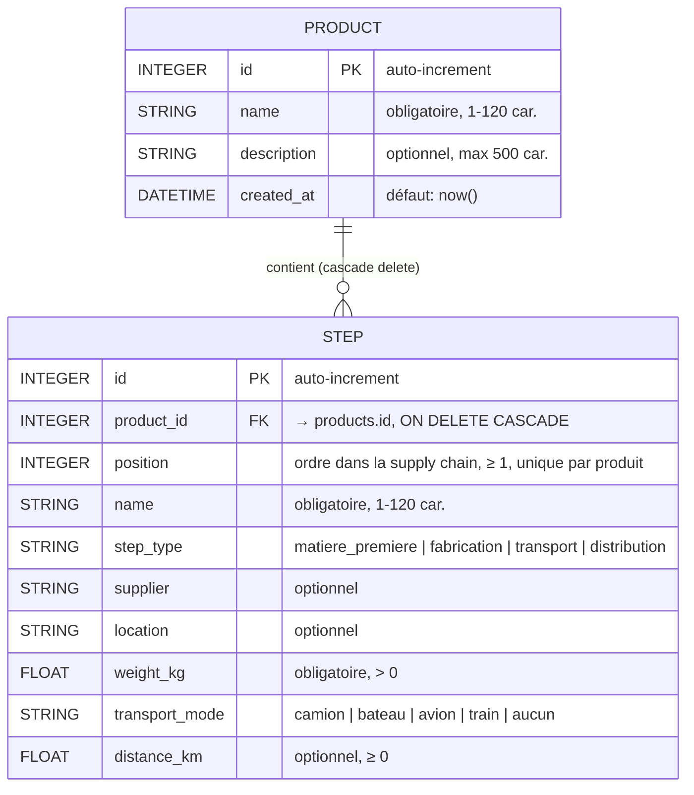

# GreenPath — MVP Traçabilité RSE

> **Problématique :** Comment permettre aux entreprises européennes de tracer l'impact environnemental de leurs produits le long de leur supply chain afin de répondre aux obligations réglementaires et valoriser leur engagement RSE ?

---

## L'équipe et la répartition des tâches

| Personne | Lot fonctionnel | État |
|---|---|---|
| **Baptiste Matrat** | Saisie produit + étapes (formulaire, validation, CRUD) | Fait |
| **Justine Rault** | Calcul CO₂ + dashboard (KPIs, détail par étape, recherche/filtres) | Fait |
| **Marie Probert** | Page publique consommateur + cohérence frontend | À faire |
| **Ferdinand Martin-Lavigne** | Fake blockchain (hash SHA-256) + QR code | À faire |
| **Maxance Villame** | Setup technique, jeu de données démo, tests | À faire |
| **Abdrahamane Mbourou Camara** | Authentification + coordination | À faire |

---

## Stack technique

| Couche | Choix | Pourquoi |
|---|---|---|
| Frontend | **Angular 19** (standalone components, signals, Reactive Forms) | Organisation claire, idéal pour le travail en équipe |
| Backend | **Python 3 + FastAPI** | Création rapide d'API REST, doc Swagger auto |
| ORM | **SQLAlchemy** | Mapping objet/relationnel simple |
| Base de données | **SQLite** (fichier local `greenpath.db`) | Zéro install, le fichier suffit |
| Validation | **Pydantic v2** | Validation des entrées API |
| Blockchain (simulée) | Fonction `anchor()` → hash SHA-256 | Remplaçable par Hyperledger en V2 sans toucher au reste |
| QR Code | librairie `qrcode` (Python) | Génère un QR par produit |

---

## Schéma de la base de données



### Notes

- **Cascade delete** : supprimer un produit supprime automatiquement toutes ses étapes.
- **Le CO₂ n'est PAS stocké en base** : il est recalculé à la volée à chaque lecture, à partir des facteurs ADEME mockés (cf. `backend/app/services/co2.py`). Cela évite toute désynchronisation si les facteurs évoluent.
- Le fichier `greenpath.db` est créé automatiquement au premier lancement du backend.

---

## Structure du projet

```
tnsi_greenpath/
├── backend/
│   ├── app/
│   │   ├── main.py               # Point d'entrée FastAPI + CORS
│   │   ├── database.py           # Connexion SQLite + session SQLAlchemy
│   │   ├── models.py             # Tables Product, Step
│   │   ├── schemas.py            # Schémas Pydantic + validations
│   │   ├── routers/
│   │   │   └── products.py       # Endpoints /products (CRUD + stats)
│   │   └── services/
│   │       └── co2.py            # Calcul d'empreinte carbone (facteurs ADEME)
│   ├── requirements.txt
│   └── greenpath.db              # SQLite (créé au runtime)
│
└── frontend/
    ├── src/app/
    │   ├── app.component.*        # Shell minimal (<router-outlet/>)
    │   ├── app.config.ts          # Providers (HttpClient, Router)
    │   ├── app.routes.ts          # /products, /products/new, /products/:id/edit
    │   ├── models/
    │   │   └── product.model.ts   # Types TypeScript + libellés
    │   ├── services/
    │   │   └── product.service.ts # Client HTTP de l'API
    │   └── components/
    │       ├── product-form/      # Création/édition d'un produit + étapes
    │       └── product-list/      # Dashboard RSE (KPIs, filtres, modales)
    ├── angular.json
    └── package.json
```

---

## Guide de démarrage

### 1. Cloner le projet

```bash
git clone https://github.com/MaxanceV/tnsi_greenpath
cd tnsi_greenpath
```

### 2. Lancer le backend (FastAPI)

```bash
cd backend

# Créer l'environnement virtuel
python -m venv .venv

# Activer
source .venv/bin/activate              # macOS / Linux
# .venv\Scripts\activate               # Windows (cmd)
# .venv\Scripts\Activate.ps1           # Windows (PowerShell)

# Installer les dépendances
pip install -r requirements.txt

# Lancer le serveur avec rechargement auto
uvicorn app.main:app --reload
```

- API : http://localhost:8000
- Documentation Swagger interactive : **http://localhost:8000/docs**

### 3. Lancer le frontend (Angular)

Dans **un autre terminal** :

```bash
cd frontend

# Installer les dépendances (la première fois uniquement)
npm install

# Lancer le serveur de dev
npm start
```

- Application : **http://localhost:4200**

> Le frontend appelle directement le backend sur `localhost:8000` (CORS configuré côté FastAPI).

---

## API REST

Toutes les routes sont documentées et testables sur http://localhost:8000/docs.

### Produits

| Méthode | URL | Description |
|---|---|---|
| `POST` | `/products` | Créer un produit avec ses étapes |
| `GET` | `/products` | Lister tous les produits (avec CO₂ calculé) |
| `GET` | `/products/{id}` | Détail d'un produit |
| `PUT` | `/products/{id}` | Mettre à jour un produit (étapes remplacées) |
| `DELETE` | `/products/{id}` | Supprimer un produit (cascade sur les étapes) |
| `GET` | `/products/stats/summary` | KPIs du dashboard (nb produits, total CO₂, moyenne) |

### Exemple : créer un produit

```bash
curl -X POST http://localhost:8000/products \
  -H 'Content-Type: application/json' \
  -d '{
    "name": "T-shirt coton bio",
    "description": "Pour audit ESPR",
    "steps": [
      {
        "position": 1,
        "name": "Culture du coton",
        "step_type": "matiere_premiere",
        "supplier": "FarmIN",
        "location": "Inde",
        "weight_kg": 0.3
      },
      {
        "position": 2,
        "name": "Livraison France",
        "step_type": "transport",
        "weight_kg": 0.3,
        "transport_mode": "bateau",
        "distance_km": 8000
      }
    ]
  }'
```

Réponse (extrait) :

```json
{
  "id": 1,
  "name": "T-shirt coton bio",
  "steps": [
    { "position": 1, "name": "Culture du coton", "co2_kg": 1.2, "..." },
    { "position": 2, "name": "Livraison France", "co2_kg": 0.036, "..." }
  ],
  "total_co2_kg": 1.236
}
```

---

## Calcul CO₂ (facteurs ADEME mockés)

Le calcul se fait dans `backend/app/services/co2.py`.

**Transport** : kg CO₂ par tonne·km

| Mode | Facteur |
|---|---|
| Avion | 1.50 |
| Camion | 0.10 |
| Train | 0.025 |
| Bateau | 0.015 |
| Aucun | 0.0 |

**Production / matière** (si l'étape n'a pas de transport) : kg CO₂ par kg de produit

| Type | Facteur |
|---|---|
| Matière première | 4.0 |
| Fabrication | 5.0 |
| Distribution | 0.2 |

**Règle** : si une étape a une `distance_km > 0` ET un `transport_mode` (≠ aucun), on calcule un CO₂ de transport (`poids_tonnes × distance × facteur_mode`). Sinon on applique le facteur de base lié au `step_type`.

---

## Fonctionnalités déjà implémentées

### Saisie produit + étapes (Baptiste)
- Formulaire Angular avec **étapes dynamiques** (ajouter/supprimer/réordonner)
- Validation côté front (Reactive Forms) **et** côté back (Pydantic)
- Édition d'un produit existant avec rechargement des étapes
- Numérotation automatique des positions

### Dashboard RSE (Justine)
- **4 KPIs** en cartes : nb produits, nb étapes, empreinte moyenne, total cumulé
- **Liste des produits** avec colonne CO₂
- **Modale de détail** avec :
  - Empreinte carbone totale mise en avant
  - Barre de répartition multicolore par étape
  - Légende avec pourcentages
  - CO₂ par étape + données complètes
- **Recherche textuelle** (nom, description, étapes, fournisseurs, lieux)
- **Filtres avancés** dans une modale dédiée :
  - Type d'étape, mode de transport
  - Fournisseur, lieu (selects dynamiques basés sur les valeurs présentes)
  - Plages poids / distance / CO₂
  - Tri (date, CO₂, nom)
- **Chips de filtres actifs** retirables individuellement
- KPIs et liste réactifs aux filtres en temps réel (Angular **signals**)

---

## Reste à faire (V2 / autres binômes)

- **Page publique consommateur** (Marie) : URL `/p/{id}` accessible via QR code, affichage simplifié
- **Authentification** (Abdrahamane) : login Responsable RSE, protection du dashboard
- **Génération de QR code** (Ferdinand) : un QR par produit pointant vers la page publique
- **Fake blockchain** (Ferdinand) : hash SHA-256 par étape, badge « Vérifié »
- **Jeu de données démo** (Maxance) : 3 produits réalistes pour la démo finale
- **Tests** (Maxance) : tests Pytest sur les calculs CO₂ et la validation

---

## Conventions de code

- **Python** : PEP 8, type hints partout, validations dans les schémas Pydantic, pas de logique métier dans les routers (passer par `services/`).
- **TypeScript / Angular** : composants standalone, `inject()` plutôt que constructor injection, **signals** pour l'état réactif, Reactive Forms pour les formulaires.
- **Git** : une feature = une branche (`feature/<nom>`). Pull request avec relecture par au moins une autre personne avant merge sur `main`.

---

## Dépannage rapide

| Problème | Solution |
|---|---|
| `npm install` échoue avec `EACCES` sur le cache | `npm install --cache /tmp/npm-cache` |
| Le frontend tourne mais ne reçoit rien | Vérifier que le backend tourne sur `localhost:8000` et que CORS autorise `localhost:4200` (déjà fait dans `main.py`) |
| `greenpath.db` corrompu / je veux repartir à zéro | Supprimer le fichier `backend/greenpath.db`, il sera recréé au prochain lancement |
| Une étape n'affiche pas de CO₂ | Vérifier que `weight_kg > 0`, et soit que `step_type` est valide, soit que `transport_mode` + `distance_km` sont renseignés |
