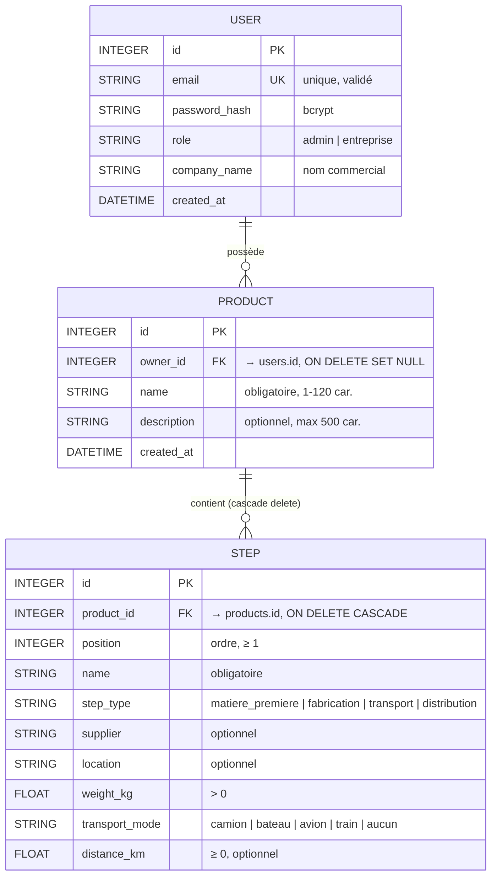

# GreenPath — MVP Traçabilité RSE

> **Problématique :** Comment permettre aux entreprises européennes de tracer l'impact environnemental de leurs produits le long de leur supply chain afin de répondre aux obligations réglementaires et valoriser leur engagement RSE ?

---

## L'équipe et la répartition des tâches

| Personne | Lot fonctionnel | État |
|---|---|---|
| **Baptiste Matrat** | Saisie produit + étapes (formulaire, validation, CRUD) | Fait |
| **Justine Rault** | Calcul CO₂ + dashboard (KPIs, détail par étape, recherche/filtres) | Fait |
| **(temporaire — Baptiste)** | Auth (login, rôles, gestion utilisateurs, vues filtrées par entreprise) | Fait |
| **Marie Probert** | Page publique consommateur + cohérence frontend | À faire |
| **Ferdinand Martin-Lavigne** | Fake blockchain (hash SHA-256) + QR code | À faire |
| **Maxance Villame** | Setup technique, jeu de données démo, tests | À faire |
| **Abdrahamane Mbourou Camara** | Coordination (auth déjà implémentée) | À faire |

---

## Stack technique

| Couche | Choix | Pourquoi |
|---|---|---|
| Frontend | **Angular 19** (standalone components, signals, Reactive Forms) | Organisation claire, idéal pour le travail en équipe |
| Backend | **Python 3 + FastAPI** | API REST rapide, doc Swagger auto |
| ORM | **SQLAlchemy** | Mapping objet/relationnel simple |
| Base de données | **SQLite** (fichier local `greenpath.db`) | Zéro install |
| Validation | **Pydantic v2** + **email-validator** | Validation des entrées API |
| Auth | **JWT** (`pyjwt`) + **bcrypt** (`passlib`) | Standard pour SPA + hash de passwords sécurisé |
| Blockchain (simulée) | Fonction `anchor()` → hash SHA-256 | Remplaçable par Hyperledger en V2 |
| QR Code | `qrcode` (Python) | Un QR par produit |

---

## Schéma de la base de données



### Notes importantes

- **Cascade delete** sur `STEP` : supprimer un produit supprime ses étapes.
- **SET NULL** sur `PRODUCT.owner_id` : si on supprime un utilisateur, ses produits restent mais perdent leur propriétaire (seul l'admin les verra).
- **Le CO₂ n'est PAS stocké** : recalculé à la volée depuis `services/co2.py` (facteurs ADEME).
- Le mot de passe est **hashé en bcrypt** avant insertion : la DB ne contient jamais de mot de passe en clair.

---

## Système d'authentification et de rôles

### Deux rôles

| Rôle | Peut faire |
|---|---|
| **`admin`** (Super Admin) | Voir tous les produits de toutes les entreprises · Créer / modifier / supprimer des utilisateurs · Changer les rôles · Accéder à `/admin/users` |
| **`entreprise`** | Voir / créer / modifier / supprimer **uniquement ses propres produits** |
| (non-connecté) | Accéder à la page publique d'un produit via `/public/products/{id}` (utilisé par le QR code consommateur) |

### Compte admin par défaut

Au tout premier démarrage du backend, si aucun utilisateur n'existe en base, un admin est créé automatiquement :

| Email | Mot de passe |
|---|---|
| `admin@greenpath.com` | `admin123` |

> **À changer en production** ! Le mot de passe peut être modifié depuis la page `/admin/users` une fois connecté.

### Flux de connexion (JWT)

1. L'utilisateur poste son email/mot de passe sur `POST /auth/login`.
2. Le backend vérifie le hash bcrypt et renvoie un **JWT** signé (clé `HS256`, durée 24h) + les infos user.
3. Le frontend stocke le token dans `localStorage` et l'envoie sur toutes les requêtes suivantes dans l'en-tête `Authorization: Bearer <token>` (via un intercepteur HTTP Angular).
4. Si une requête renvoie `401`, l'intercepteur déconnecte l'utilisateur automatiquement.

---

## Structure du projet

```
tnsi_greenpath/
├── backend/
│   ├── app/
│   │   ├── main.py                # Point d'entrée FastAPI + bootstrap admin + CORS
│   │   ├── database.py            # Connexion SQLite + session SQLAlchemy
│   │   ├── models.py              # Tables User, Product, Step
│   │   ├── schemas.py             # Schémas Pydantic + validations
│   │   ├── dependencies.py        # get_current_user, require_admin
│   │   ├── routers/
│   │   │   ├── auth.py            # /auth/login, /auth/me
│   │   │   ├── users.py           # /users (admin seulement)
│   │   │   ├── products.py        # /products (filtré par rôle)
│   │   │   └── public.py          # /public/products/{id} (pour le QR code)
│   │   └── services/
│   │       ├── auth.py            # bcrypt + JWT
│   │       └── co2.py             # Calcul d'empreinte carbone (facteurs ADEME)
│   ├── requirements.txt
│   └── greenpath.db               # SQLite (créé au runtime)
│
└── frontend/
    ├── src/app/
    │   ├── app.component.ts        # Shell avec barre de navigation + logout
    │   ├── app.config.ts           # Providers (HttpClient + interceptor JWT)
    │   ├── app.routes.ts           # Routes protégées par guards
    │   ├── models/
    │   │   ├── product.model.ts
    │   │   └── auth.model.ts       # User, UserRole, LoginRequest, etc.
    │   ├── services/
    │   │   ├── product.service.ts
    │   │   ├── user.service.ts     # CRUD users (admin only)
    │   │   ├── auth.service.ts     # login, logout, currentUser signal
    │   │   └── auth.interceptor.ts # ajoute le Bearer token + gère 401
    │   ├── guards/
    │   │   └── auth.guard.ts       # authGuard, adminGuard, guestGuard
    │   └── components/
    │       ├── login/              # Page de connexion
    │       ├── product-form/       # Création/édition d'un produit
    │       ├── product-list/       # Dashboard RSE (filtré selon rôle)
    │       └── admin-users/        # Gestion des utilisateurs (admin only)
    ├── angular.json
    └── package.json
```

---

## Guide de démarrage

### 1. Cloner le projet

```bash
git clone https://github.com/MaxanceV/tnsi_greenpath
cd tnsi_greenpath
```

### 2. Installation des dépendances (à faire une seule fois)

```bash
# Backend
cd backend
python -m venv .venv
source .venv/bin/activate         # macOS/Linux
# .venv\Scripts\activate          # Windows
pip install -r requirements.txt
cd ..

# Frontend
cd frontend
npm install
cd ..
```

### 3. Lancement en une commande (RECOMMANDÉ)

Une fois les dépendances installées, **un seul script** suffit pour tout démarrer :

```bash
./start.sh        # macOS / Linux
start.bat         # Windows (double-clic dessus, ou taper dans cmd)
```

Ce script :
- détecte si la base de données est vide → exécute le **seed** automatiquement (3 entreprises, 9 produits, 2 consommateurs dont Léa avec un panier rempli)
- démarre le **backend** (FastAPI sur `localhost:8000`, accessible aussi sur l'IP LAN)
- démarre le **frontend** (Angular sur `localhost:4200`)
- affiche les URLs et les comptes démo
- redirige les logs dans `logs/backend.log` et `logs/frontend.log`
- arrête proprement les deux serveurs sur `Ctrl+C`

À l'écran tu verras :

```
========================================================================
  GreenPath est lancé !
  Frontend : http://localhost:4200
  Backend  : http://localhost:8000
  Swagger  : http://localhost:8000/docs

  Comptes démo :
    Admin        admin@greenpath.com         / admin123
    Entreprise   petitemarie@demo.greenpath  / demo123
    Consommateur lea@demo.greenpath          / demo123  (avec panier rempli)
========================================================================
```

### Lancement manuel (alternative, pour debug ou contrôle fin)

Si tu préfères lancer les deux serveurs séparément (deux terminaux) :

#### Backend (FastAPI)

```bash
cd backend
source .venv/bin/activate              # macOS / Linux
# .venv\Scripts\activate               # Windows
uvicorn app.main:app --reload --host 0.0.0.0
```

- API : http://localhost:8000
- Documentation Swagger interactive : **http://localhost:8000/docs**
- Au premier démarrage, l'admin par défaut est créé (cf. section auth ci-dessus).

#### Données de démonstration (optionnel — fait automatiquement par `start.sh`)

Si tu veux peupler la BDD manuellement (9 produits réalistes, 6 entreprises, 2 consommateurs dont Léa avec son panier rempli) :

```bash
# Dans backend/, venv activé
python seed_demo.py
```

Le script est **idempotent** : tu peux le relancer sans risquer de doublons.

| Compte démo (mot de passe `demo123`) | Type | Détail |
|---|---|---|
| `petitemarie@demo.greenpath` | Entreprise | Petite Marie Textile (T-shirt + Sweat coton bio) |
| `biobuzz@demo.greenpath` | Entreprise | BioBuzz Confitures (Confiture + Jus d'orange) |
| `chocoprovence@demo.greenpath` | Entreprise | Chocolaterie Provençale |
| `cafe@demo.greenpath` | Entreprise | Maison du Café |
| `vergers@demo.greenpath` | Entreprise | Vergers Provence (Pommes + Avocats) |
| `domaine@demo.greenpath` | Entreprise | Domaine Bio Bordeaux (Vin) |
| `lea@demo.greenpath` | Consommateur | Léa Dupont, 8 produits scannés |
| `tom@demo.greenpath` | Consommateur | Tom Martin, 3 produits scannés |

#### Frontend (Angular)

Dans **un autre terminal** :

```bash
cd frontend
npm start
```

- Application : **http://localhost:4200**
- Tu seras redirigé vers `/login`. Utilise `admin@greenpath.com` / `admin123`.

### 4. Accéder depuis un autre appareil sur le même Wi-Fi (téléphone, ordi voisin)

L'application est conçue pour fonctionner sur le **réseau local** — indispensable pour scanner les QR codes depuis un téléphone pendant la démo.

Trois étapes à respecter :

1. Lancer les deux serveurs **avec l'option `--host 0.0.0.0`** (déjà gérée dans le `npm start` ; pour uvicorn cf. commande ci-dessus)
2. Autoriser les connexions entrantes dans le **pare-feu** de l'OS hôte
3. Récupérer l'IP LAN de l'ordi hôte et l'ouvrir depuis le téléphone : `http://<IP-LAN>:4200`

#### A. Trouver son IP LAN

| OS | Commande |
|---|---|
| **macOS** | `ipconfig getifaddr en0` (Wi-Fi) ou `ipconfig getifaddr en1` |
| **Linux** | `hostname -I` ou `ip addr show` |
| **Windows (cmd / PowerShell)** | `ipconfig` puis chercher **IPv4** sous la section "Carte réseau sans fil Wi-Fi" |

L'IP attendue ressemble à `192.168.x.x`, `10.x.x.x` ou `172.16-31.x.x`.

> Un script pratique pour macOS / Linux : `./scripts/show-lan-url.sh` (affiche directement les URLs à partager).

#### B. Autoriser les connexions entrantes (pare-feu) — la cause #1 des problèmes

##### Windows (le plus piégeux)

À la **toute première fois** que tu lances `uvicorn` puis `npm start`, Windows affiche une popup :

> *Voulez-vous autoriser Python à communiquer sur ces réseaux ?*

**IMPORTANT** : cocher **"Réseaux privés"** (au minimum) puis **Autoriser**. Pareil pour Node.

Si tu as raté la popup ou cliqué *Annuler* :

1. *Paramètres → Confidentialité et sécurité → Sécurité Windows → Pare-feu et protection du réseau*
2. *Autoriser une application via le pare-feu*
3. Cliquer *Modifier les paramètres* (admin) puis *Autoriser une autre application*
4. Ajouter `python.exe` (celui de ton `.venv`) et `node.exe` → cocher **Privé**
5. Valider, relancer les serveurs

Alternative rapide (pas idéale en termes de sécurité, OK le temps de la démo) : désactiver complètement le pare-feu pour le profil **Privé**.

##### macOS

À la première écoute, macOS peut demander si Python / Node peut accepter les connexions entrantes → **Autoriser**.

Si déjà refusé ou pas demandé :

1. *Réglages Système → Réseau → Pare-feu → Options…*
2. Vérifier que Python (celui du venv) et Node sont sur **"Autoriser les connexions entrantes"**

Alternative pour la démo : désactiver complètement le pare-feu (*Réglages Système → Réseau → Pare-feu* → Off).

##### Linux (Ubuntu / Debian — ufw)

```bash
sudo ufw allow 4200/tcp
sudo ufw allow 8000/tcp
# Ou si ufw n'est pas actif, il n'y a probablement rien à faire.
```

Pour vérifier : `sudo ufw status`.

#### C. Tester la connectivité

Sur l'appareil hôte, dans un terminal :

```bash
# Remplace par ton IP LAN
curl http://192.168.1.42:8000/
# Doit renvoyer : {"status":"GreenPath Backend en ligne"}
```

Depuis le téléphone, ouvre le navigateur et tape : `http://192.168.1.42:4200`

**Si tout va bien** → tu vois la page de login GreenPath, identique à celle de l'ordi.

#### D. Tester le QR code

1. Sur l'ordi hôte, ouvre le navigateur **à l'adresse LAN** : `http://192.168.1.42:4200` (PAS `localhost:4200`)
2. Connecte-toi en admin, choisis un produit, clique **QR code**
3. Le QR généré encode `http://192.168.1.42:4200/p/<id>` → scannable par le téléphone

> Si tu génères le QR depuis `localhost:4200`, il encodera `localhost:4200/p/<id>` qui ne fonctionnera pas depuis le téléphone. **Toujours générer les QR depuis l'IP LAN**.

#### E. Cas où ça ne marchera jamais (Wi-Fi public / eduroam / cafés)

Beaucoup de Wi-Fi publics activent une protection appelée **client isolation** (ou *AP isolation*) : les appareils connectés peuvent accéder à Internet mais **pas se voir entre eux**. C'est le cas de :

- Eduroam (variable selon l'établissement, souvent isolé)
- Wi-Fi des hôtels, cafés, gares
- Certains hotspots d'opérateur

Test rapide : depuis le téléphone, faire `ping <IP-de-l-ordi>`. Si ça ne répond pas → client isolation, rien à faire côté code.

**Solutions** :
- Utiliser le **partage de connexion d'un téléphone** comme point d'accès commun (le plus fiable pour les démos itinérantes)
- Apporter sa propre **mini box Wi-Fi**
- Utiliser un **tunnel internet** (ngrok, Cloudflare Tunnel) — me demander si tu veux qu'on l'ajoute

---

## API REST

Toutes les routes sont documentées et testables sur http://localhost:8000/docs.

### Auth

| Méthode | URL | Auth | Description |
|---|---|---|---|
| `POST` | `/auth/login` | Public | Échange email/password contre un JWT |
| `GET` | `/auth/me` | Connecté | Infos de l'utilisateur courant |

### Produits (filtrés automatiquement par rôle)

| Méthode | URL | Auth | Description |
|---|---|---|---|
| `POST` | `/products` | Connecté | Créer un produit (le `owner_id` est l'utilisateur connecté) |
| `GET` | `/products` | Connecté | Lister ses produits (admin : tous) |
| `GET` | `/products/{id}` | Connecté | Détail (403 si pas propriétaire et pas admin) |
| `PUT` | `/products/{id}` | Connecté | Mettre à jour |
| `DELETE` | `/products/{id}` | Connecté | Supprimer |
| `GET` | `/products/stats/summary` | Connecté | KPIs du dashboard (filtrés par rôle) |

### Utilisateurs (admin uniquement)

| Méthode | URL | Description |
|---|---|---|
| `GET` | `/users` | Lister tous les utilisateurs |
| `POST` | `/users` | Créer un utilisateur |
| `PUT` | `/users/{id}` | Modifier (entreprise, rôle, mot de passe) |
| `DELETE` | `/users/{id}` | Supprimer (impossible de se supprimer soi-même) |

### Public (pour la future page consommateur du QR code)

| Méthode | URL | Description |
|---|---|---|
| `GET` | `/public/products/{id}` | Détail public d'un produit, sans authentification |

### Exemple : se connecter et créer un produit

```bash
# 1. Login → récupère le token
TOKEN=$(curl -s -X POST http://localhost:8000/auth/login \
  -H 'Content-Type: application/json' \
  -d '{"email":"admin@greenpath.com","password":"admin123"}' \
  | grep -oE '"access_token":"[^"]+' | cut -d'"' -f4)

# 2. Créer un produit avec le token
curl -X POST http://localhost:8000/products \
  -H "Authorization: Bearer $TOKEN" \
  -H 'Content-Type: application/json' \
  -d '{
    "name": "T-shirt coton bio",
    "steps": [
      { "position": 1, "name": "Culture", "step_type": "matiere_premiere", "weight_kg": 0.3, "location": "Inde" },
      { "position": 2, "name": "Livraison", "step_type": "transport", "weight_kg": 0.3, "transport_mode": "bateau", "distance_km": 8000 }
    ]
  }'
```

---

## Calcul CO₂ (facteurs ADEME mockés)

Le calcul se fait dans `backend/app/services/co2.py`.

**Transport** : kg CO₂ par tonne·km

| Mode | Facteur |
|---|---|
| Avion | 1.50 |
| Camion | 0.10 |
| Train | 0.025 |
| Bateau | 0.015 |
| Aucun | 0.0 |

**Production / matière** (si l'étape n'a pas de transport) : kg CO₂ par kg

| Type | Facteur |
|---|---|
| Matière première | 4.0 |
| Fabrication | 5.0 |
| Distribution | 0.2 |

**Règle** : si une étape a `distance_km > 0` ET un `transport_mode` (≠ aucun), on calcule un CO₂ de transport. Sinon on applique le facteur de base lié au `step_type`.

---

## Vues selon le rôle

### Vue Entreprise (rôle `entreprise`)
- Voit uniquement ses propres produits dans le dashboard
- Peut créer, modifier, supprimer **ses** produits
- Les KPIs (CO₂ moyen, total) sont calculés sur ses produits uniquement
- N'a pas accès à `/admin/users` (redirigé vers `/products`)

### Vue Super Admin (rôle `admin`)
- Voit **tous les produits de toutes les entreprises** dans le dashboard
- Une colonne "Entreprise" apparaît sur chaque ligne
- A accès au lien **"Utilisateurs"** dans la barre de navigation
- Peut créer / modifier / supprimer des utilisateurs et changer leur rôle
- Ne peut pas se retirer son propre rôle admin ni se supprimer (garde-fou)

### Vue Publique (non connecté)
- Aucun accès au dashboard (redirigé vers `/login`)
- Accès en lecture seule à `/public/products/{id}` (utilisé par le QR code consommateur)
- La page consommateur frontend est en cours (Marie)

---

## Fonctionnalités déjà implémentées

### Saisie produit + étapes (Baptiste)
- Formulaire Angular avec étapes dynamiques (ajouter/supprimer/réordonner)
- Validation côté front (Reactive Forms) **et** côté back (Pydantic)

### Dashboard RSE (Justine)
- 4 KPIs en cartes (auto-filtrés selon rôle)
- Liste avec colonne CO₂ (+ colonne Entreprise visible uniquement par l'admin)
- Modale de détail avec barre de répartition multicolore
- Recherche textuelle + filtres avancés (type, transport, fournisseur, lieu, poids, distance, CO₂) dans une modale dédiée
- Chips de filtres actifs retirables

### Authentification et rôles
- Login JWT, intercepteur HTTP, guards de routes
- Vues filtrées automatiquement par `owner_id` côté backend
- Page admin de gestion des utilisateurs (création, édition, changement de rôle, suppression)
- Endpoint public pour la future page consommateur

---

## Reste à faire (V2 / autres binômes)

- **Page publique consommateur** (Marie) : URL `/p/{id}` accessible via QR code, design simplifié
- **Génération de QR code** (Ferdinand) : un QR par produit pointant vers la page publique
- **Fake blockchain** (Ferdinand) : hash SHA-256 par étape, badge « Vérifié »
- **Jeu de données démo** (Maxance) : 3 produits réalistes pour la démo
- **Tests** (Maxance) : Pytest sur CO₂ et validation
- **Sécurité prod** (Abdrahamane) : `SECRET_KEY` en variable d'environnement, durée de token configurable, refresh token éventuellement

---

## Conventions de code

- **Python** : PEP 8, type hints partout, logique métier dans `services/`, validations dans Pydantic.
- **TypeScript / Angular** : composants standalone, `inject()`, **signals** pour l'état réactif, Reactive Forms.
- **Git** : `feature/<nom>`. PR avec relecture avant merge sur `main`.

---

## Dépannage rapide

### Installation / dépendances

| Problème | Solution |
|---|---|
| `npm install` échoue avec `EACCES` sur le cache | `npm install --cache /tmp/npm-cache` |
| `passlib` plante avec `password cannot be longer than 72 bytes` | Vérifier que `bcrypt<4.1` est bien installé (`pip install "bcrypt<4.1"`) |
| **Windows** : `pip install` plante sur `bcrypt` ou `Pillow` avec `Microsoft Visual C++ 14.0 required` | Utiliser **Python 3.11 ou 3.12** (les roues précompilées existent). Python 3.13 manque encore certaines roues. |
| **Windows** : `source .venv/bin/activate` introuvable | Sur Windows c'est `.venv\Scripts\activate` (cmd) ou `.venv\Scripts\Activate.ps1` (PowerShell) |
| `greenpath.db` corrompu / je veux repartir à zéro | Supprimer le fichier `backend/greenpath.db` (l'admin sera re-créé) |

### Runtime

| Problème | Solution |
|---|---|
| Login refusé alors que je connais le password | Si tu as ajouté un user "à la main" en SQL, son password n'est pas hashé — recrée-le via l'API |
| Front bloqué sur le login en boucle | Le token a expiré (24h) → re-login. Si ça persiste, vide le `localStorage` du navigateur |
| Je veux changer la `SECRET_KEY` du JWT | Modifier `backend/app/services/auth.py`. En prod, à mettre en variable d'env |
| Un produit n'affiche pas de CO₂ | Vérifier `weight_kg > 0`, et soit `step_type` valide, soit `transport_mode + distance_km` |
| Erreur CORS `localhost:4200` | Vérifier que le backend tourne et que CORS est ouvert sur `localhost:4200` dans `main.py` |

### Accès LAN (autre appareil sur le même Wi-Fi)

| Problème | Solution |
|---|---|
| Le téléphone n'arrive pas à charger la page (timeout) | Vérifier que le backend ET le frontend sont lancés avec `--host 0.0.0.0` (déjà fait dans `npm start` ; à ajouter manuellement pour uvicorn : `uvicorn app.main:app --reload --host 0.0.0.0`) |
| **macOS** : autre appareil ne joint pas le Mac | Le pare-feu macOS bloque par défaut. Réglages → Réseau → Pare-feu → désactiver, ou autoriser Python/Node spécifiquement |
| **Windows** : autre appareil ne joint pas le PC | À la première écoute, Windows affiche une popup "Autoriser Python sur les réseaux privés" → cocher **Privé**. Si raté : Paramètres → Pare-feu → Autoriser une application → cocher Python |
| Wi-Fi public / eduroam : aucun appareil ne joint l'autre | **Client isolation** activé (sécurité réseau). Impossible à contourner sans changer de réseau. Solution : utiliser un **partage de connexion téléphone** comme point d'accès commun |
| Page chargée mais erreur au login / CORS | Vérifier que tu accèdes au front avec l'IP LAN, pas `localhost`. Le front dérive l'URL backend de l'URL utilisée. |
| Le QR code scanné depuis le téléphone ouvre `localhost:4200` (qui ne marche pas) | Le QR encode l'`Origin` de la requête. Il faut **régénérer** le QR depuis le navigateur ouvert sur l'IP LAN (pas `localhost`). |
